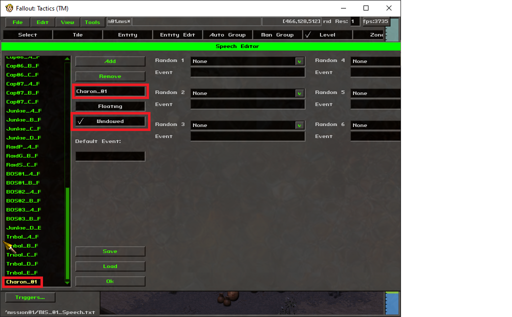
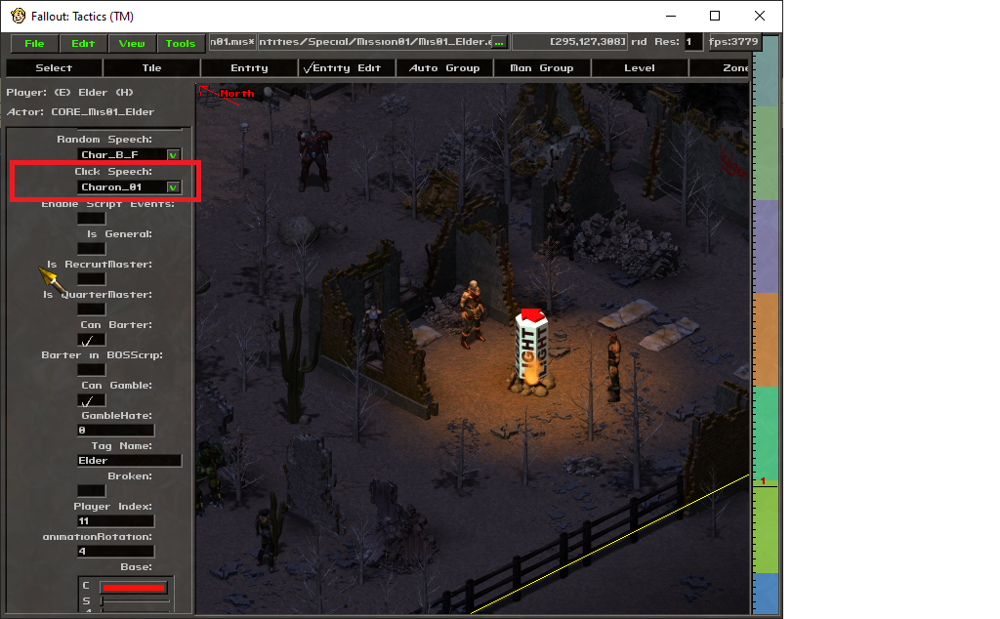

# Interactive Dialogue

The Dialogue module in FTSE 0.60a provides the ability to create actual interactive
dialogue for the player, using a modified version of the normal WSpeech
window. A modification can define a dialogue tree for a specific character,
and the module will handle movement through the tree as options are
selected. The module will then give the window updates to FTSE to pass
through to the game UI.

NPC character conversations are defined using a Lua table. The table
contains a named definition for each node - the name is used in selecting
which node should come next from a user choice, and the contents of the
node are a subtable with specific fields indicating the text to display,
optional audio files or scripts, and new conversation options to present
to the user.

## Basic Usage

To use the capabilities of the module, the following steps need to be
done:

* Include the Dialogue module, and store the returned object:

```lua
speech=require "FTSE.modules.Dialogue"
```

* Generate a conversation object as defined below. This is an individual
Lua file with a single return statement returning a table containing the
conversation nodes. A barebones conversation would look like the following:

```lua
return {
  start={
    text="This is a basic conversation with only one node.",
    choices={
      {
        node="exit",
        text="(Done.)",
        priority=1
      }
    }
  }
}
```

* Register the conversation file with the module by calling the
@{Dialogue:LoadConversation} function in ftse.lua (or a derived file). The register call
includes a tag string to associate with the conversation, and a filename
expressed as a module location (e.g. using '.' as directory divider):

```lua
speech:LoadConversation("Charon_01","FTSE.examples.Dialogue.charon")
```

* In the level editor, under the "Level" tab, select the "Speech..."
button. In this window, click the "Add" button to create a new speech
node, then highlight the new node (should be at the bottom of the list).
In the name of the node, enter the tag string exactly as in the LoadConversation
call (case must match), and make sure that the "Windowed" box is checked:



It is not necessary to have any in-game text tied to the speech node; FTSE will intercept the
handling for that tag and will start the Dialogue module with the registered conversation.

* Under the "Entity Edit" tab, select the entity that will initiate the conversation,
and set the "Click Speech" option to the speech node created above:



## Conversation details

In all conversations, the engine starts from a required node named
"start". In the above example, the start node is an example of a "text" node.
The "text" field contains the NPC conversation text to display, and the
"choices" field contains a Lua table/array of selections to present to
the user, with each selection requiring a "text" field to show as the
player character's conversation text, and a "node" field indicating which
new node to jump to.

There are three special destination nodes: "exit" will end the conversation
and resume the game, "barter" will end the conversation while bringing
up the barter window, and "gamble" will end the conversation while 
bringing up the gambling window.

A second node type is the "code" node; this will contain a single "code"
field containing Lua code to run when the node is reached. This can be
used for conditionally jumping to nodes based on game conditions, or
for executing script code to e.g. give or take items to/from the player,
or otherwise manipulate the game state.

There are further advanced options that are described in the documentation
for the Dialogue module. These include nested conversations, audio file
handling, and conditional choices based on stat checks or other
criteria.